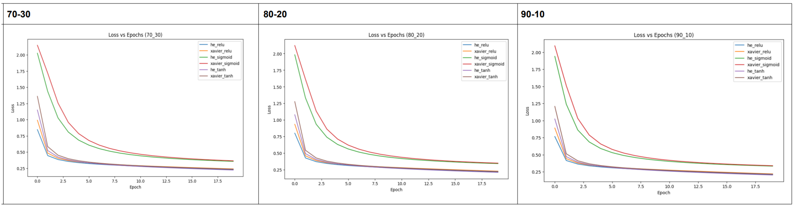
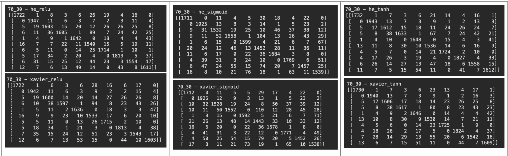
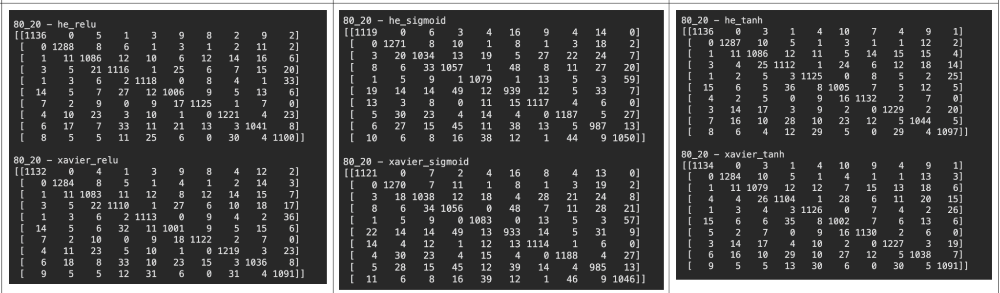
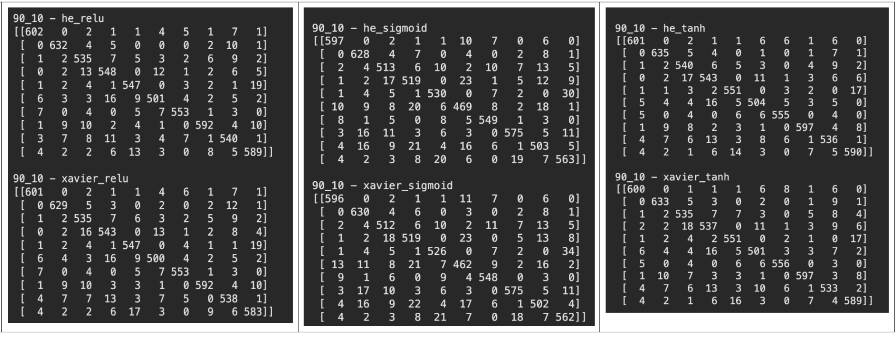

# Artificial Neural Network from Scratch on MNIST

# Google Colab

🔗 https://drive.google.com/file/d/1iZEi_DKaG-HFtVxCdAKDqHpxS5mRLjHk/view?usp=drive_link

---

## Introduction

This project implements a fully connected Artificial Neural Network (ANN) from scratch using PyTorch tensor operations without relying on built-in neural network layers.

The objective is to understand the complete workflow of neural networks including:

- Weight Initialization
- Forward Propagation
- Activation Functions
- Backpropagation
- Gradient Descent
- Multi-Class Classification

The model is trained on the MNIST handwritten digit dataset and evaluated using multiple train-test splits.

---

# Dataset

## MNIST

- 70,000 handwritten digit images
- 10 classes (0-9)
- Image Size: 28 × 28
- Flattened Input Size: 784

---

# Architecture

```text
Input Layer (784)

        ↓

Hidden Layer (128)

        ↓

Output Layer (10)
```

### Total Parameters

```text
Input → Hidden
784 × 128 + 128

Hidden → Output
128 × 10 + 10

Total Parameters ≈ 101,770
```

---

# Experimental Setup

## Weight Initializations

### Xavier Initialization

Suitable for:

- Sigmoid
- Tanh

### He Initialization

Suitable for:

- ReLU

---

## Activation Functions

### ReLU

$$
f(x)=max(0,x)
$$

### Sigmoid

$$
f(x)=\frac{1}{1+e^{-x}}
$$

### Tanh

$$
f(x)=\frac{e^x-e^{-x}}{e^x+e^{-x}}
$$

---

# Train-Test Splits

- 70-30
- 80-20
- 90-10

---

# Results

---

# Accuracy Summary

| Split | Configuration | Accuracy |
|---------|---------|---------|
| 70-30 | He + ReLU | 93.06% |
| 70-30 | Xavier + ReLU | 92.80% |
| 70-30 | He + Sigmoid | 90.14% |
| 70-30 | Xavier + Sigmoid | 89.96% |
| 70-30 | He + Tanh | 93.47% |
| 70-30 | Xavier + Tanh | 93.16% |
| 80-20 | He + ReLU | 93.64% |
| 80-20 | Xavier + ReLU | 93.26% |
| 80-20 | He + Sigmoid | 90.83% |
| 80-20 | Xavier + Sigmoid | 90.28% |
| 80-20 | He + Tanh | 93.77% |
| 80-20 | Xavier + Tanh | 93.46% |
| 90-10 | He + ReLU | 93.98% |
| 90-10 | Xavier + ReLU | 93.68% |
| 90-10 | He + Sigmoid | 90.77% |
| 90-10 | Xavier + Sigmoid | 90.52% |
| 90-10 | He + Tanh | 94.03% |
| 90-10 | Xavier + Tanh | 93.87% |

---

## Loss Curves

<p align="center">
  
</p>

---

## Confusion Matrices

<p align="center">
  
</p>

<p align="center">
  
</p>

<p align="center">
  
</p>

---

# Handwritten Report

📄 https://drive.google.com/file/d/1gMmFGm0JCDFaSRchsr-55xLagP1P5F2_/view?usp=drive_link

---

# Theory

## Weight Initialization

Proper initialization prevents exploding and vanishing gradients.

### Xavier Initialization

$$
W \sim \mathcal{N}
\left(
0,
\frac{1}{fan_{in}}
\right)
$$

Used primarily with:

- Sigmoid
- Tanh

### He Initialization

$$
W \sim \mathcal{N}
\left(
0,
\frac{2}{fan_{in}}
\right)
$$

Used primarily with:

- ReLU

---

## Forward Propagation

Input:

$$
X \in \mathbb{R}^{B\times784}
$$

Hidden Layer:

$$
Z_1=XW_1+b_1
$$

Activation:

$$
A_1=f(Z_1)
$$

Output Layer:

$$
Z_2=A_1W_2+b_2
$$

Predictions:

$$
\hat{Y}=Softmax(Z_2)
$$

---

## Loss Function

Categorical Cross Entropy:

$$
L=
-\sum_{i=1}^{N}
y_i\log(\hat y_i)
$$

---

## Backpropagation

Weights are updated using Gradient Descent:

$$W_{new}=W_{old}-\eta\frac{\partial L}{\partial W}$$

where:

- $\eta$ = learning rate

---

# Key Findings

- Tanh achieved the best overall performance.
- He Initialization consistently improved convergence for ReLU.
- Sigmoid suffered from slower convergence.
- Increasing training data improved classification accuracy.
- Proper weight initialization significantly impacts optimization performance.

---

## Author

**Pranav Deshpande**  
IIT Jodhpur  
* Deep Learning 
* Neural Networks 
* Computer Vision
